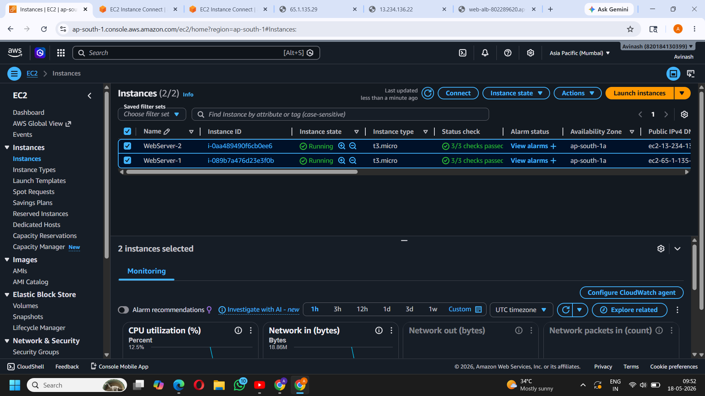
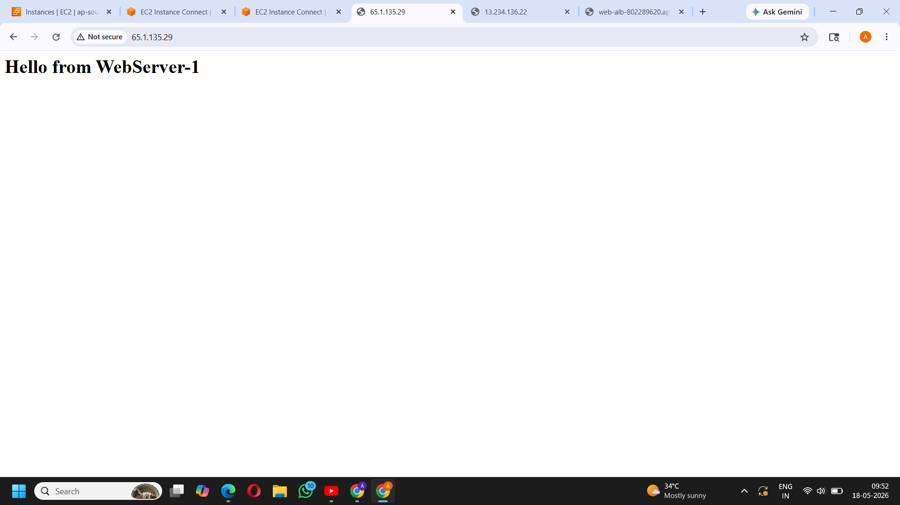
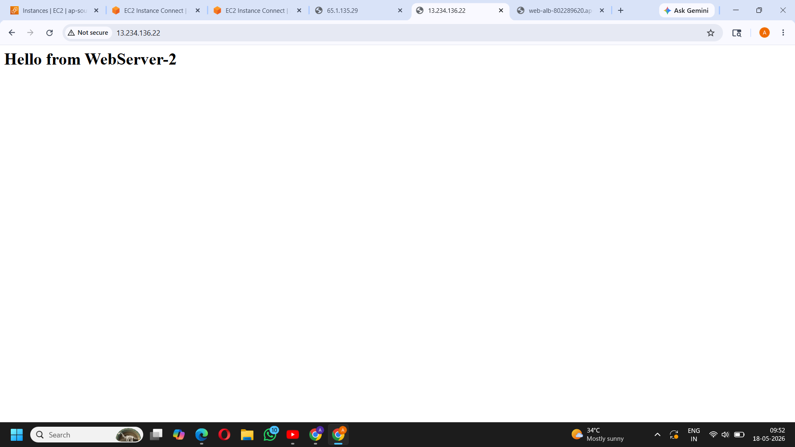
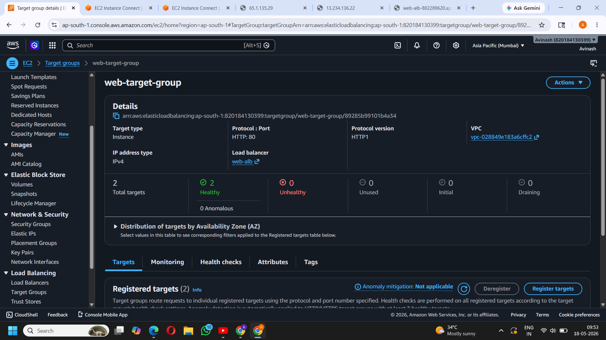
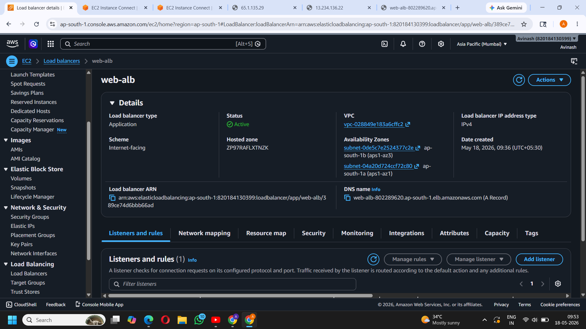
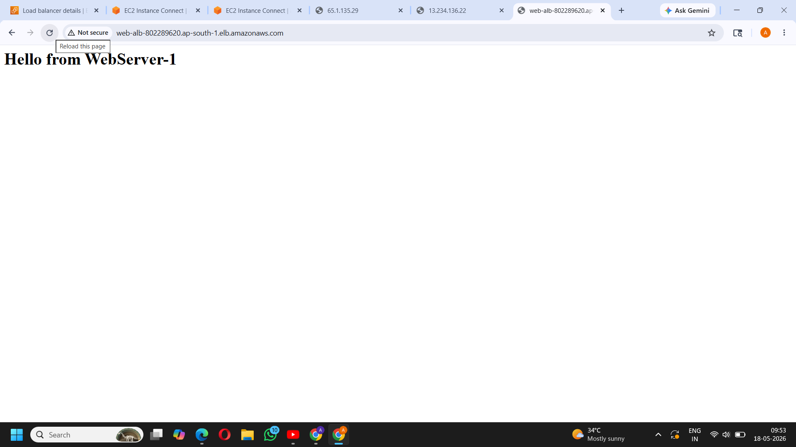

<h1 align="center">☁️ AWS High Availability Web Application</h1>

Scalable and fault-tolerant web architecture deployed using AWS Cloud Services

EC2 • Load Balancer • Target Group • AMI • Security Groups

---

## 🎯 Project Objective

To design and deploy a highly available web application on AWS ensuring:
- Scalability
- Fault tolerance
- Load balancing between multiple EC2 instances

---

## 🏗️ Architecture

User → Application Load Balancer → Target Group → EC2 Instances

---

## ☁️ AWS Services Used

- Amazon EC2 (Web Servers)
- Application Load Balancer (Traffic Distribution)
- Target Group (Health Monitoring)
- Amazon Machine Image (AMI)
- Security Groups (Firewall Rules)

---

## ⚙️ Implementation Steps

### 1️⃣ EC2 Setup
- Launched 2 EC2 instances
- Installed Apache web server

### 2️⃣ Web Deployment
- Created simple HTML pages for testing

### 3️⃣ Load Balancer Setup
- Created Application Load Balancer (ALB)
- Attached Target Group

### 4️⃣ Health Check Configuration
- Registered EC2 instances
- Verified instance health status

### 5️⃣ Testing
- Accessed ALB DNS
- Verified traffic distribution between servers

### 6️⃣ AMI Creation
- Created Amazon Machine Image (AMI)
- Used for reusable server deployment

---

## 📸 Screenshots

### EC2 Instances

### Web Server Output (Server 1)

### Web Server Output (Server 2)

### Target Group Health Status

### Load Balancer DNS Output

### Final Application Output

---

## 🚀 Key Learnings

- AWS EC2 instance lifecycle
- Load balancing and traffic distribution
- High availability architecture design
- Health checks and Target Groups
- AMI creation and reuse

---

## 📊 Outcome

Successfully deployed a production-style highly available web application on AWS Cloud.

---

## 👨‍💻 Author

**Avinash Patil**  
Cloud & DevOps Engineer (Aspiring)
